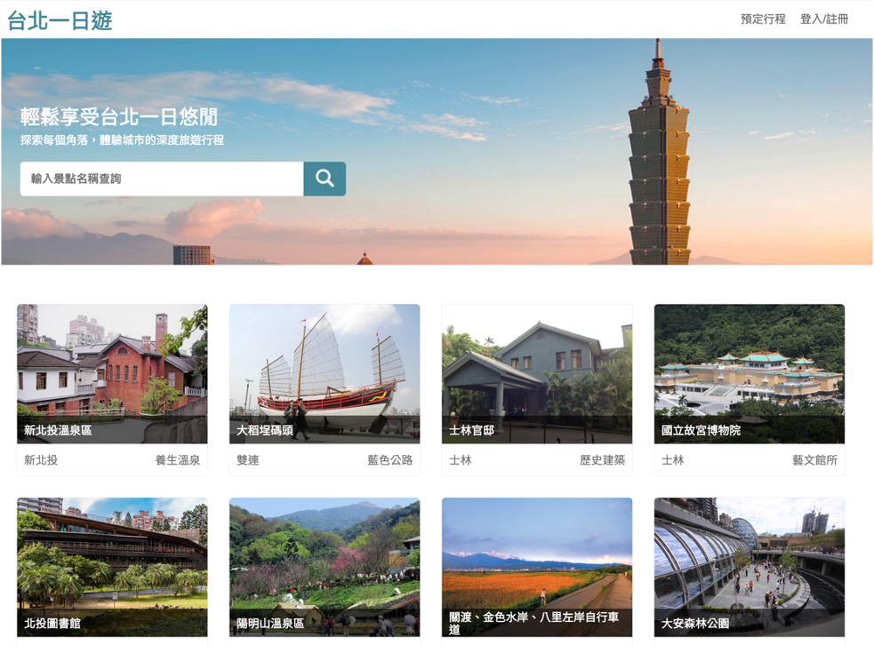
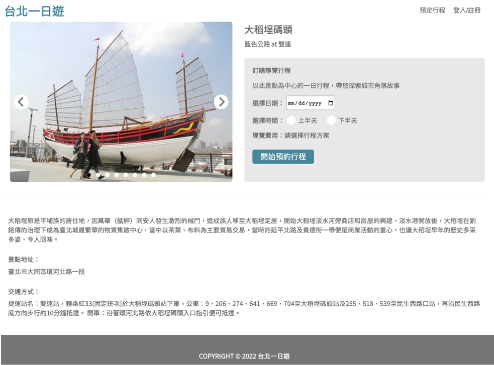
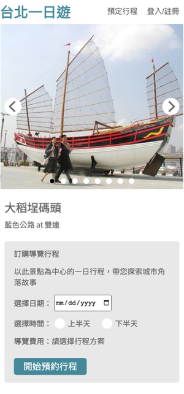
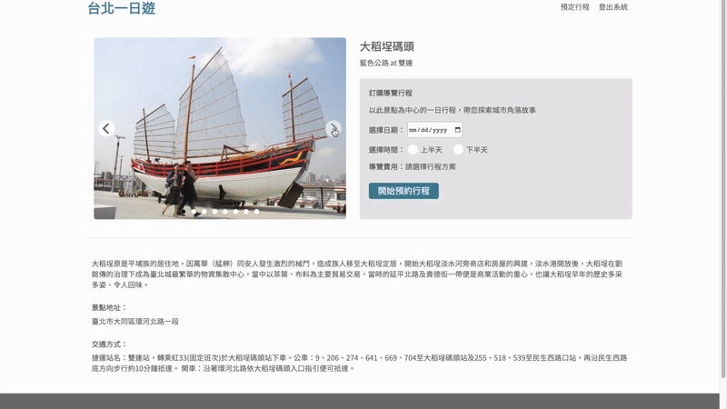
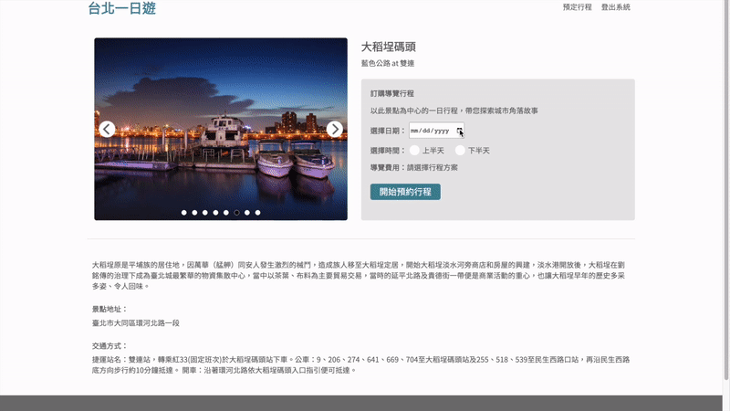
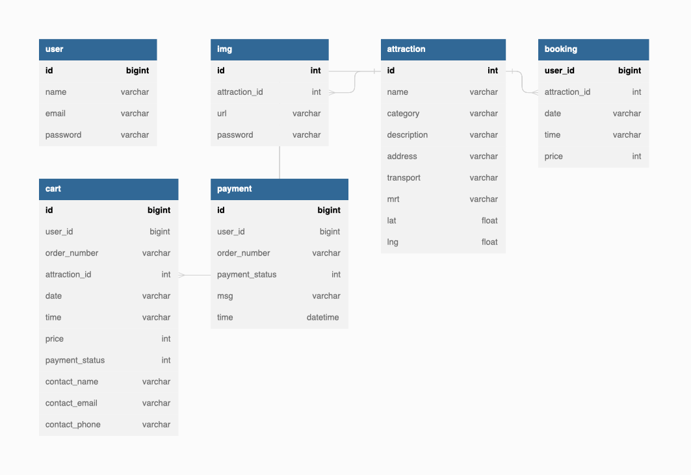

# Taipei Day Trip

Taipei Day Trip is an e-commerce tourism website that allows users to browse and search for information about well-known tourist attractions in Taipei City. Users can choose a suitable travel plan and book guided tour services through the website.

🔗&nbsp;&nbsp;**Project link:** http://43.206.54.81:3000/
 
| Test Info | Value |
| ------------- | ------------- |
| email | test@gmail.com |
| password | test1234 |
| card number | 4242 4242 4242 4242 |
| card expiration date | 01 / 24 |
| card ccv | 123 |
 

## Table Content

- [Main Feature](#main-feature)
- [Feature Demo](#featrue-demo)
- [Backend Technique](#backend-technique)
- [Frontend Technique](#frontend-technique)
- [Database Design](#database-design)
- [API Document](#api-document)
- [Real World Testing](#real-world-testing)
- [Contact](#contact)

## Main Feature

- Python **Flask** application runs on EC2
- **MySQL** to store highly relevant customer order data with **database normalization (3NF)**
- **TapPay SDK** as third-party payment system for trip booking
- **JSON Web Token (JWT)** for user authentication
- Build **infinite scroll, image carousel** with pure JavaScript
   

## Feature Demo

- Attraction card infinity scroll

    
     

- Attraction image carousel

    
     

- Book trip procedure

    
     

## Backend Technique

- Environment
  - Python Flask
- Database
  - MySQL
- AWS Cloud Service
  - EC2
- Third Party Library
  - TapPay SDK
     

## Frontend Technique

- HTML / CSS / JavaScript
   

## Database Design

 

## API Document

🔗&nbsp;&nbsp;**Document link:** https://app.swaggerhub.com/apis-docs/padax/taipei-day-trip/1.1.0

## Contact

👨‍💻 盧廷洋 Ting-Yang, Lu

📫 Email: tingyang.lu.14@gmail.com
